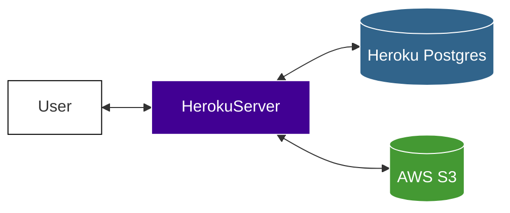

## 概要
- 企業用のホームページ

## 公開URL
> https://www.izuden.jp/

## 技術
- 言語
  - Python
- フレームワーク
  - Django
- インフラ
  - Heroku
  - AWS S3

## インフラ構成図

```mermaid
graph LR
    User[User] <-->WebServer[HerokuServer]
    WebServer <--> DB[(Heroku Postgres)]
    WebServer <--> S3[(AWS S3)]

    style User fill:#fff,color:#00000,stroke:#000000
    style WebServer fill:#410093,color:#ffffff,stroke:#ffffff
    style S3 fill:#493,color:#ffffff,stroke:#ffffff
    style DB fill:#31648B,color:#ffffff,stroke:#ffffff
```
